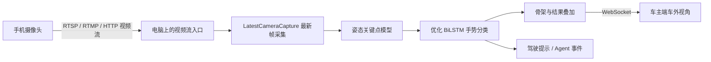

# 手机摄像头实时交警手势识别接入方案

## 1. 目标

答辩现场没有真实车外摄像头，因此使用手机模拟车外行车记录仪：

1. 同学 A 在摄像头前完成交警指挥手势。
2. 同学 B 使用手机横屏拍摄同学 A。
3. 手机把实时视频传到运行 IRV 的电脑。
4. IRV 后端持续读取最新画面，调用优化后的姿态模型和 BiLSTM 模型。
5. 车主端“车外视角”实时显示完整画面、人体骨架、手势名称、置信度和驾驶提示。

本功能的重点是**实时视频流识别**，不是先录制、再上传、再等待整段视频处理。

## 2. 最终演示效果

- 手机和电脑连接同一个局域网或同一个手机热点。
- 车主端选择“手机摄像头”，输入或选择手机视频源。
- 点击“连接”，车外视角在 3 秒内出现手机画面。
- 点击“开始交警识别”，画面继续播放，并实时叠加骨架和识别结果。
- 模型忙于推理时主动丢弃旧帧，只处理最新帧，避免画面越积越卡。
- 断流时明确显示“手机视频源已断开”，并允许一键重连。
- 点击停止后释放视频连接和推理会话，不影响本地视频测试功能。

建议验收指标：

| 指标 | 最低目标 | 理想目标 |
| --- | --- | --- |
| 端到端延迟 | 小于 1.5 秒 | 300-800 ms |
| 模型处理速度 | 不低于 5 FPS | 8-12 FPS |
| 画面显示 | 完整显示，不拉伸、不裁切 | 720p 横屏 |
| 首次连接时间 | 小于 5 秒 | 小于 3 秒 |
| 断流反馈 | 3 秒内提示 | 自动重连 |

## 3. 当前项目已经具备的能力

这不是从零开发，当前代码已经完成了主要推理链路：

| 已有能力 | 位置 | 说明 |
| --- | --- | --- |
| 实时摄像头识别 WebSocket | `backend/routers/traffic_police.py` | `/api/traffic-police/optimized-camera-live` 已接收 `source_url` |
| 最新帧采集 | `vendor/optimized_traffic/engine.py` | `LatestCameraCapture` 持续采集，只把最新帧交给模型 |
| 优化 BiLSTM 推理 | `vendor/optimized_traffic/engine.py` | `LiveGestureSession` 输出骨架、类别、置信度和耗时 |
| 实时绘制结果 | `frontend/index.html` | `startOptimizedTrafficCamera()` 已能接收并绘制 WebSocket 帧 |
| 本地视频算法测试 | `frontend/index.html` | 保留上传视频测试，不与手机实时模式混用 |

当前主要缺口：

- 前端没有让用户配置和选择手机视频源的完整入口。
- 摄像头列表仍以固定 RTSP 地址为主，没有“手机摄像头”来源管理。
- 缺少连接探测、错误分类、重连和答辩用状态提示。
- 手机端采用哪种推流方式尚未统一。
- 实时识别结果还需要正式接入驾驶提示和 Agent 事件。

## 4. 推荐架构



### 推荐方案：MediaMTX 作为电脑端视频流入口

手机不直接连接 Python 模型，而是先把视频发布到电脑上的 MediaMTX，再由 IRV 后端读取稳定的 RTSP 地址。

示例地址：

```text
手机发布地址：rtmp://电脑局域网IP:1935/phone
IRV 读取地址：rtsp://127.0.0.1:8554/phone
```

选择这个方案的原因：

- 手机、Python 后端和模型三者解耦，某一层重启时更容易排查。
- MediaMTX 支持 RTSP、RTMP、WebRTC 等协议，Android 和 iPhone 更容易找到兼容应用。
- IRV 当前已经使用 RTSP 和 OpenCV，改动较少。
- 答辩电脑读取本机 `127.0.0.1` 的 RTSP 流，比后端直接长时间连接手机更稳定。

### 快速备选：手机直接提供 HTTP 视频

部分 Android 摄像头应用可以直接提供类似下面的 MJPEG 地址：

```text
http://手机局域网IP:8080/video
```

可以先用 VLC 验证地址，再把它作为 `source_url` 交给后端。此方案部署最少，但不同手机应用的地址格式、编码和稳定性不统一，只建议作为快速联调或备用方案。

### 暂不作为 MVP：纯手机浏览器 WebRTC

手机浏览器直接打开页面并授权摄像头，体验最好，但需要 HTTPS、安全上下文、信令服务，以及复杂网络下的 TURN 中继。可以作为第二阶段功能，首轮答辩不应依赖它。

## 5. 实时处理流程

1. 前端选择“手机摄像头”，填写流地址或选择已保存的手机源。
2. 后端先探测视频源能否在规定时间内打开并读取一帧。
3. 前端连接 `/api/traffic-police/optimized-camera-live`。
4. WebSocket 首包发送：

```json
{
  "source_url": "rtsp://127.0.0.1:8554/phone",
  "camera_index": 0
}
```

5. 后端启动独立采集线程；采集线程不断覆盖“最新帧”。
6. 推理线程每次只取最新帧，不建立待处理帧队列。
7. 后端返回绘制后的 JPEG、识别类别、置信度、推理耗时、处理 FPS 和丢帧数。
8. 前端在同一个车外播放器中绘制画面，并更新驾驶提示。
9. 连续多帧满足置信度与稳定条件后，才产生一次业务事件和 Agent 提示。

当前服务端返回格式示例：

```json
{
  "type": "frame",
  "frame": "BASE64_JPEG",
  "gesture": {
    "id": 1,
    "name": "停止",
    "confidence": 0.91,
    "inference_ms": 86.4
  },
  "frame_index": 128,
  "processing_fps": 9.7,
  "dropped_frames": 214
}
```

注意：`dropped_frames` 表示为了实时性跳过了旧画面，不等于识别错误。实时系统宁可跳帧，也不能积压后慢慢播放过去的画面。

## 6. 需要开发的内容

### 6.1 手机视频源管理

建议新增以下配置字段：

```json
{
  "id": "phone_cam",
  "name": "答辩手机摄像头",
  "type": "mobile_stream",
  "source_url": "rtsp://127.0.0.1:8554/phone",
  "enabled": true
}
```

MVP 可以先保存在用户偏好或 `.env` 中；数据库组员后续可建立 `camera_sources` 表。不要把带用户名、密码的完整地址写入日志。

建议接口：

| 方法 | 路径 | 用途 |
| --- | --- | --- |
| `GET` | `/api/mobile-camera/status` | 获取当前手机源、连接状态和最后一帧时间 |
| `POST` | `/api/mobile-camera/probe` | 测试地址是否能打开并读取首帧 |
| `POST` | `/api/mobile-camera/connect` | 保存来源并设为当前车外视频源 |
| `POST` | `/api/mobile-camera/disconnect` | 主动断开并释放资源 |

MVP 也可以不新增推理接口，继续复用现有 `/api/traffic-police/optimized-camera-live`。

### 6.2 车主端 UI

在“车外视角”底部增加来源选择，不新增复杂页面：

- 来源：固定摄像头 / 手机摄像头 / 本地视频。
- 手机地址输入框与“测试连接”按钮。
- “开始识别”和“停止”按钮。
- 状态：未连接、连接中、直播中、识别中、断线重连、连接失败。
- 指标：当前手势、置信度、处理 FPS、端到端延迟。
- 视频画面保持 `object-fit: contain`，完整显示手机横屏内容，空白区域使用黑色填充。

本地视频仍属于“交警手势算法测试”；手机直播属于真实车外实时识别，两种模式应在文案和状态上明确区分。

### 6.3 后端稳定性

- 视频源打开设置 3-5 秒超时，不能无限等待。
- 采集和推理解耦，只保留最新帧。
- 读取连续失败时返回具体错误并释放 `VideoCapture`。
- 允许有限次数自动重连，采用 1 秒、2 秒、4 秒退避。
- 新连接开始时创建新的 `LiveGestureSession`，避免继承上一段视频的时序窗口。
- 同一视频源只允许一个活动推理会话，防止重复加载和 GPU/CPU 抢占。
- 第一版继续使用 Base64 JPEG；性能不足时再改为 WebSocket 二进制帧。

### 6.4 识别结果接入业务层

模型逐帧输出不能直接逐帧生成告警。建议满足以下条件后再触发业务事件：

- 置信度达到项目实测阈值，例如 `>= 0.75`。
- 最近 5 帧中至少 3 帧为同一个非“无手势”类别。
- 同类别事件设置 2-3 秒冷却，避免一段动作产生大量重复告警。
- 识别结果映射为“停止、直行、左转、左待转、右转、变道、减速、靠边停车”。
- 稳定结果发布到现有 EventBus，由 Agent 生成驾驶建议和必要告警。

阈值必须通过现场视频测试后确定，不要为了看起来灵敏而直接采用单帧结果。

## 7. 组员分工建议

| 负责人 | 工作内容 | 交付物 |
| --- | --- | --- |
| 手机与网络 | 选择推流应用、配置 MediaMTX、整理手机操作步骤 | 一台手机可稳定发布 720p 视频流 |
| 后端视频 | 手机源探测、连接状态、超时、重连、资源释放 | 手机流可被 OpenCV 连续读取 10 分钟 |
| 算法 | 模型实时推理、稳定窗口、置信度阈值和性能测试 | FPS、延迟、准确率测试记录 |
| 前端 | 来源选择、连接按钮、完整画面、状态和识别 HUD | 车外视角可完成连接、识别、停止 |
| Agent/数据库 | 稳定识别事件入库、去重、告警和历史记录 | 一次有效手势只生成一条业务事件 |
| 联调与答辩 | 局域网、防火墙、备用视频与演示脚本 | 可重复执行的答辩流程和故障预案 |

建议开发顺序：手机流能被 VLC 播放 -> OpenCV 能读取 -> WebSocket 能返回标注帧 -> 前端接入 -> 事件与数据库接入。不要一开始同时修改所有模块。

## 8. 联调步骤

### 第一步：验证网络

1. 手机与电脑连接同一个 Wi-Fi；没有路由器时可使用另一台手机开热点。
2. 在电脑执行 `ipconfig`，记录无线网卡 IPv4 地址。
3. 手机尝试访问电脑对应服务端口，确认 Windows 防火墙没有拦截。
4. 答辩前关闭 VPN、代理和可能改变路由的虚拟网卡。

### 第二步：验证原始视频流

1. 启动 MediaMTX 或手机 HTTP 摄像头服务。
2. 手机开始横屏推流。
3. 先使用 VLC 打开 RTSP/HTTP 地址。
4. 连续播放 5 分钟，确认画面不会周期性断开。

只有 VLC 能稳定播放后，才进入 IRV 联调。否则先排查网络和推流，不要修改模型代码。

### 第三步：验证后端推理

1. 启动 IRV。
2. 打开浏览器开发者工具，连接实时识别 WebSocket。
3. 确认依次收到“加载模型”“识别已启动”和 `frame` 消息。
4. 记录 `processing_fps`、`inference_ms` 和 `dropped_frames`。
5. 手机停止推流，确认后端能退出或进入重连，而不是一直假装运行。

### 第四步：验证前端和业务

1. 车外播放器完整显示横屏画面。
2. 人体从头到脚进入画面，骨架位置正确。
3. 连续完成每一种交警手势并记录识别结果。
4. 确认稳定手势才产生驾驶提示。
5. 确认同一个动作不会生成大量重复 Agent 告警。

## 9. 拍摄规范

算法效果不仅由模型决定，答辩时必须统一拍摄方式：

- 手机使用横屏，建议 1280x720、15-30 FPS。
- 被识别者全身进入画面，尤其不能截掉手臂和手部。
- 手机尽量固定，避免边走边拍造成背景和人体同时晃动。
- 人物与背景保持明显对比，避免逆光和过暗环境。
- 建议人物距离手机 3-5 米，具体距离以骨架完整为准。
- 同一个动作保持 1-2 秒，动作之间回到自然姿态。
- 首次加载模型可能较慢，正式演示前先完成一次预热。

## 10. 答辩现场操作清单

1. 提前启动 MediaMTX、IRV 后端和浏览器页面。
2. 手机连接指定局域网，关闭移动数据自动切换。
3. 手机横屏并固定，发布到预设路径 `phone`。
4. 电脑用 VLC 快速确认视频源。
5. 车主端选择“手机摄像头”，点击测试连接。
6. 画面正常后启动交警手势实时识别。
7. 演示停止、直行、左转或减速等识别效果。
8. 展示驾驶提示和 Agent 事件记录。
9. 演示结束后停止识别并释放视频源。

备用方案：保留一段已验证的本地测试视频。当现场无线网络不可用时，立即切换到本地视频测试，但需要向评委明确说明这是故障兜底，不是实时摄像头输入。

## 11. 完成标准

满足以下条件后，本功能才算完成：

- 手机视频无需先保存文件即可进入 IRV。
- 车外视角完整、连续显示手机实时画面。
- 交警手势模型处理的是直播最新帧，而不是延迟队列。
- UI 能显示连接、推理、断线和停止状态。
- 识别结果经过稳定窗口后接入驾驶提示与 Agent。
- 刷新页面或重新连接不会遗留旧推理线程。
- 连续运行 10 分钟无明显内存增长、无限积压或无法停止的问题。
- 答辩组员能仅根据本文档完成搭建、联调和故障切换。
